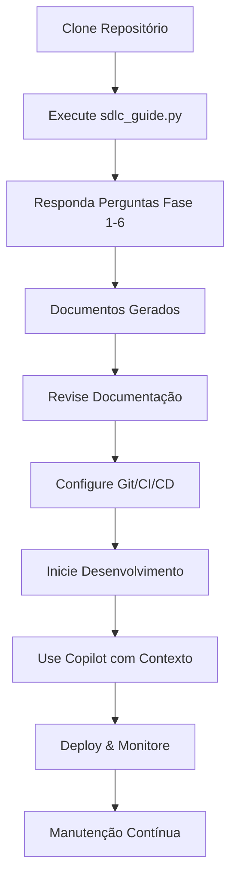

# ESTRUTURA-ENGENHARIA-CONTEXTO

Sistema SDLC Interativo com Engenharia de Contexto para GitHub Copilot

## 🎯 Visão Geral

Este repositório fornece uma estrutura flexível e interativa para guiar desenvolvedores através do **Software Development Life Cycle (SDLC)** completo, integrado com as melhores práticas de **engenharia de contexto** para GitHub Copilot.

### Características Principais

✨ **Guia Interativo SDLC** - Script Python que conduz o usuário através de perguntas sequenciais  
📚 **Geração Automática de Documentos** - Cria documentação completa baseada nas respostas  
🤖 **Otimização para Copilot** - Parâmetros ajustados por tipo de tarefa (criatividade vs. precisão)  
🔄 **Estrutura Flexível** - Adaptável a diferentes tipos de projetos  
📁 **Organização Clara** - Pastas bem definidas para cada fase do desenvolvimento  

## 🚀 Início Rápido

### 1. Clone o Repositório

```bash
git clone <URL-DO-SEU-REPOSITORIO>
cd ESTRUTURA-ENGENHARIA-CONTEXTO
```

### 2. Instale as Dependências

```bash
pip install -r requirements.txt
```

### 3. Execute o Guia SDLC

```bash
python3 sdlc_guide.py
```

O script irá guiá-lo através de 6 fases principais:

1. **Requisitos e Análise** - Define escopo e necessidades
2. **Design e Arquitetura** - Projeta a estrutura do sistema
3. **Implementação** - Define padrões de código e ferramentas
4. **Testes** - Estabelece estratégia de qualidade
5. **Implantação** - Planeja deployment e monitoramento
6. **Manutenção** - Define processos de suporte contínuo

## 📁 Estrutura do Repositório

```
/project-root
   ├── sdlc_guide.py        # 🎮 Script interativo do SDLC
   ├── ESTRUTURA.TXT        # 📋 Regras de engenharia de contexto
   ├── SDLC.md              # 📖 Documentação completa do SDLC
   ├── requirements.txt     # 📦 Dependências Python
   ├── README.md            # 📄 Este arquivo
   ├── /docs                # 📚 Documentação formal gerada
   │     ├── URS.md         # User Requirement Specification
   │     ├── architecture.md # Documento de Arquitetura
   │     └── test_plan.md   # Plano de Testes
   ├── /guides              # 📘 Guias práticos gerados
   │     ├── implementation.md  # Guia de Implementação
   │     ├── deployment.md      # Guia de Deployment
   │     └── maintenance.md     # Guia de Manutenção
   ├── /videos              # 🎥 Transcrições de vídeos
   ├── /urls                # 🌐 Conteúdo web convertido
   └── /code                # 💻 Código-fonte do projeto
```

## 🤖 Engenharia de Contexto para Copilot

Este repositório implementa parâmetros otimizados para GitHub Copilot baseados no tipo de tarefa:

### Configuração por Tipo de Tarefa

| Tipo de Tarefa | Top-k | Top-p | Temperature | Token Budget | Aplicação |
|----------------|-------|-------|-------------|--------------|-----------|
| **Criativa** (Design, Arquitetura) | 50-100 | 0.9-0.95 | 0.7-0.9 | 4000-8000 | /guides, arquitetura |
| **Literal** (Código, APIs) | 1-10 | 0.1-0.3 | 0.1-0.3 | 2000-4000 | /code, implementações |
| **Documentação** | 20-40 | 0.5-0.7 | 0.4-0.6 | 3000-6000 | README, /docs |
| **Testes** | 10-30 | 0.3-0.5 | 0.2-0.4 | 2500-5000 | arquivos de teste |
| **Análise/Transcrição** | 15-35 | 0.4-0.6 | 0.3-0.5 | 5000-10000 | /videos, /urls |

### Melhores Práticas

✅ **Especificidade** - Prompts claros e bem delimitados  
✅ **Contexto Rico** - Fornecer exemplos do repositório  
✅ **Escopo Definido** - Tarefas com critérios de aceitação  
✅ **Exemplos** - Incluir one-shot/few-shot samples  
✅ **Iteração** - Usar PR comments para refinamento  
✅ **Revisão** - Sempre revisar outputs antes de merge  

Consulte `ESTRUTURA.TXT` para detalhes completos.

## 📚 Documentos Gerados Automaticamente

Após executar o `sdlc_guide.py`, você terá:

### Em `/docs`:
- **URS.md** - Especificação de Requisitos do Usuário
- **architecture.md** - Documento de Arquitetura do Sistema
- **test_plan.md** - Plano Completo de Testes

### Em `/guides`:
- **implementation.md** - Guia de Implementação com Padrões
- **deployment.md** - Guia de Implantação e CD
- **maintenance.md** - Guia de Manutenção e Operação

### Sessão Salva:
- **sdlc_session.json** - Todas as respostas para referência futura

## 🔄 Fluxo de Trabalho



## 🛠️ Ferramentas e Dependências

O `requirements.txt` inclui:

### Processamento de Documentação
- `markdown` - Processamento de arquivos Markdown
- `pyyaml` - Parsing de arquivos YAML

### Processamento de PDFs
- `PyPDF2` - Extração de texto de PDFs
- `pdfplumber` - Análise avançada de PDFs

### Transcrição de Vídeos
- `youtube-transcript-api` - Obtenção de transcrições

### Web Scraping
- `requests` - Requisições HTTP
- `beautifulsoup4` - Parsing de HTML
- `html2text` - Conversão HTML para texto

### Análise de Código
- `autopep8` - Formatação automática Python
- `pylint` - Linter Python
- `black` - Formatador de código

### Testes
- `pytest` - Framework de testes
- `pytest-cov` - Cobertura de código

## 🎓 Fases do SDLC Detalhadas

### Fase 1: Requisitos e Análise
- Coleta de necessidades do cliente
- Definição de funcionalidades
- Critérios de sucesso
- Regras de negócio

### Fase 2: Design e Arquitetura
- Escolha de arquitetura (SOA, Microservices, etc.)
- Definição de stack tecnológico
- Modelagem de dados
- Requisitos de segurança

### Fase 3: Implementação
- Padrões de código
- Controle de versão
- Gerenciamento de segredos
- Documentação contínua

### Fase 4: Testes
- Testes unitários e de integração
- Framework de testes
- Meta de cobertura
- CI/CD setup

### Fase 5: Implantação
- Plataforma de hospedagem
- Estratégia de deployment
- Pipeline de CD
- Monitoramento

### Fase 6: Manutenção
- Métricas de monitoramento
- Alertas e notificações
- Backup de dados
- Otimização de custos

## 🔧 Etapas Paralelas (CI/CD)

Estas atividades rodam continuamente:

- **Controle de Versão** - Git para rastreamento de mudanças
- **Gerenciamento de Branches** - Desenvolvimento isolado
- **Integração Contínua** - Testes automáticos
- **Entrega Contínua** - Deploy automatizado

## 📖 Referências

- [GitHub Copilot Best Practices](https://docs.github.com/en/enterprise-cloud@latest/copilot/tutorials/coding-agent/get-the-best-results)
- [GitHub Copilot Coding Agent Concepts](https://docs.github.com/en/copilot/concepts/agents/coding-agent)
- [SDLC.md](./SDLC.md) - Documentação completa do SDLC
- [ESTRUTURA.TXT](./ESTRUTURA.TXT) - Regras de engenharia de contexto

## 🤝 Contribuindo

Este repositório é uma estrutura base flexível. Sinta-se livre para:

1. Adaptar o `sdlc_guide.py` às suas necessidades
2. Adicionar novas fases ou perguntas
3. Customizar templates de documentos
4. Integrar com suas ferramentas favoritas

## 📝 Licença

Este projeto é uma estrutura de referência para desenvolvimento de software seguindo as melhores práticas do SDLC.

---

**Desenvolvido com ❤️ para facilitar o desenvolvimento de software estruturado**

*Para dúvidas ou sugestões, abra uma issue no repositório.*
